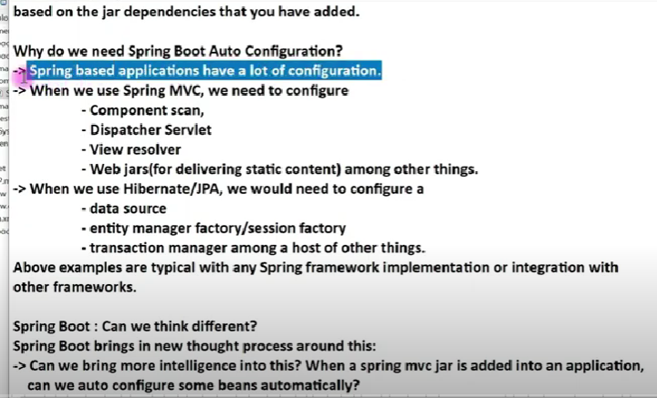
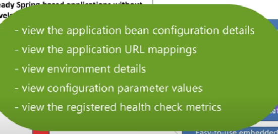

## SpringBoot Intro

- The main goal of Springboot is to quickly create production ready Spring-based applications without requiring developers to write the same boilerplate config again and again

- Spring boot offers 5 things: **Springboot starters, springboot autoconfiguration,externalize configuration and easy to use embedded servlet container support**

### Springboot starters

- Spring boot starters takes care of maintaining dependency compatability.
- Starter dependencies give us the ability to avoid a lot of boilerplate code. With the starter-web dependency in itself, it comes with 8 other transitive dependencies.

```
org.springframework:spring-core
org.springframework:spring-web
org.springframework:spring-webmvc
com.fasterxml.jackson.core:jackson-databind
org.hibernate:hibernate-validator
org.apache.tomcat.embed:tomcat-embed-core
org.apache.tomcat.embed:tomcat-embed-el
org.apache.tomcat.embed:tomcat-embed-logging-juli
```

### Springboot Autoconfiguration

- Automatically autoconfigure beans based on jar dependencies

- 
  When we add hibernate to classpath. then springboot would automatically config data source bean,
  entity manager bean...
  Q: Why not automate all these configurations?
  A: Yes we can with springboot! If springboot detects spring mvc components in classpath, then springboot autoconfigures component scan,dispatcher servlet,view resolver and etc

  - Spring-boot-autoconfigure-2.5.0.jar

### Externalized configuration

- We use annotations that gather info from properties files and/or yaml to configure...

### Spring boot actuators

!

### Easy to use embedded servlet container support

With Spring:

- Download tomcat
- Set tomcat server
- War file
- Explicitly deploy war file to a tomcat server.
  With Springboot starter-web
- Provides tomcat as a default embedded server

### Creating a Springboot application

- Spring initializer web
- Spring initializer integrated in eclipse/intellij
- SpringBoot CLI

- Snapshot types are not stable

### Logging on springboot through application properties...

- Logging.level.org.springframework=DEBUG
- Debugs and gives you additional info on whats going on in the application.
- XYZ dependency is found in classpath bassed on conditonal property..
- Maven dependencies has the list of all jars
- For autoconfiguration we use the autoconfigure jar... when we want to autoconfigure something we check this jar for their respective autoconfigure class.

  DispatcherServletAutoConfiguration class being matched means its autoconfiguration is enabled.

### SpringBoot Application Execution Process
