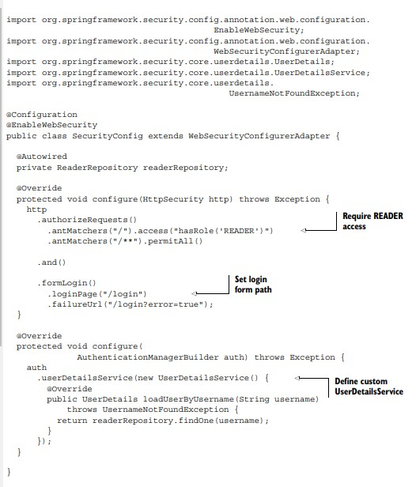
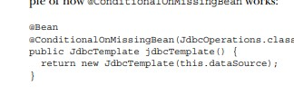

## Chapter 3: Customizizng Configuration

- - In order to make your application secure all you need to do is install the start-security dependency
- in maven e.g)

```
<dependency>
  <groupId>org.springframework.boot</groupId>
  <artifactId>spring-boot-starter-security</artifactId>
  </dependency>
```

- We can add custom configuration if we do explicit configurations. Overriding the transitive dependencies

- This explicit configuration can take any form
  that Spring supports, including XML configuration and Groovy-based configuration.

- 

- If you put this configuration in your application, this will override the autoconfigure in the classpath

- Spring Security offers several options for authentication, including authentication
  against JDBC-backed user stores, LDAP-backed user stores, and in-memory user stores

- Create a jpa entity, create a repository that persists that object,create a MVC then u got yourself an application. Thymeleaf for a nice frontend applcation

pg72)

**entity vs object**(copied quora answer)

- A model is some object that has fields, getters and setters - what we call a POJO, or “plain ol’ Java object.” It’s just a place we put our data, rather than a place we put business logic.

- An entity is annotated as **@Entity, and has a special relationship with your database** - generally each instance of an entity corresponds to a single row and the class itself corresponds to the table in which those rows are stored. In any case, we supply annotations for persistence on our entity classes.

In some cases, we’ll have a model class with an @Entity annotation, which means that model is also an entity. Sometimes we just want to use the model to pass information around our program without persisting it, or we want to persist it only after a service class does some business logic to it, and then store it in a distinct entity class.

- 

- beans can be used in any class ....

Declaring a Bean:

- To declare a bean, simply annotate a method with the @Bean annotation. When JavaConfig encounters such a method, it will execute that method and register the return value as a bean within a BeanFactory. By default, the bean name will be the same as the method name (see bean naming for details on how to customize this behavior). The following is a simple example of a @Bean method declaration:

```@Configuration
@EnableConfigurationProperties
@ConditionalOnClass({ EnableWebSecurity.class })
@ConditionalOnMissingBean(WebSecurityConfiguration.class)
@ConditionalOnWebApplication
public class SpringBootWebSecurityConfiguration {
...
}
```

Configure this class..
enable config properties--->
we will not run this configuration if we dont have enablewebsecurity.class in the classpath
we will not run this config if theres already a bean websecurityConfiguration in the classpath
we will not run this if this application is not a web application

@EnableWebSecurity, we’re indirectly creating a
bean of type WebSecurityConfiguration. Therefore, by the time auto-configuration
takes place, there will already be a bean of type WebSecurityConfiguration, the
@ConditionalOnMissingBean condition will fail, and any configuration offered by
SpringBootWebSecurityConfiguration will be skipped over.
Although Spring Boot’s auto-configuration and @Conditional

### Setting properties for Spring Boot

1 Command-line arguments
2 JNDI attributes from java:comp/env
3 JVM system properties
4 Operating system environment variables
5 Randomly generated values for properties prefixed with random.\* (referenced
when setting other properties, such as `${random.long})
6 An application.properties or application.yml file outside of the application
7 An application.properties or application.yml file packaged inside of the
application
8 Property sources specified by @PropertySource
9 Default properties

**precedence lvls**
1 Externally, in a /config subdirectory of the directory from which the application is run
2 Externally, in the directory from which the application is run
3 Internally, in a package named “config”
4 Internally, at the root of the classpath

**pg76**
