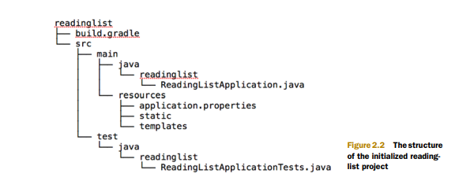
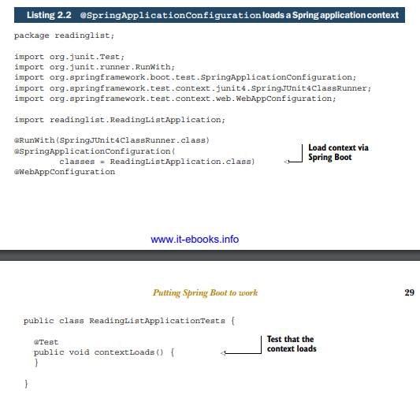
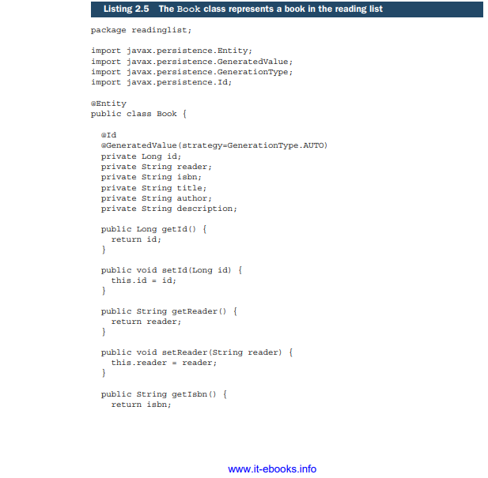
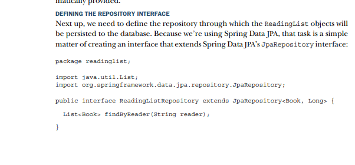
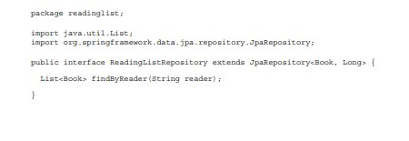

# Developing your first Springboot Application

- spring has many features that make it easier to develop a java application but Spring framework would rely on you to add all the library dependencies to the projects build specification.(maven or gradle build tool).
  And it was your job to write configuration to tell Spring what to do.

- Springboot added a level of automation to spring development through Starter dependencies and automatic configuration.

- We can create a springboot application by going on intellij Idea or the website
  https://start.spring.io/ to create the project with the dependencies of your choosing..

- In the newly created project the project structure folows the layout of a typical maven
  or gradle project as shown below

- There are 4 main components of the project

- build.gradle—The Gradle build specification
- ReadingListApplication.java—The application’s bootstrap class and primary
  Spring configuration class
- application.properties—A place to configure application and Spring Boot
  properties
- ReadingListApplicationTests.java—A basic integration test class

### ReadingListApplication.java

- Let's first tackle ReadingListApplication class
- The @SpringbootApplication enables Spring component-scanning
  so that components and web controller classes in the application will be registered as beans in the Spring
  Application Context. @SpringbootApplication annotation also makes the class a configuration class... with
  it being bundled with @Configuration aswell. @EnableAutoConfiguration is bundled in the annotation aswell to give the ability of
  autoconfiguration.
- It's best to use the @Configuration..

Simply put, this is a class-level annotation used to create a web version of the application context in the Spring Framework.

### ReadingListApplicationsTest

- we use the @SpringApplicationConfiguration to load the context of the
  springboot application configuration class of choice..

### application.properties

- Application properties are completely optional.. you can remove it without impacting the application
- it loads by itself, at no point do we need to explicit call for application properties

### gradle and maven build...

- artifact shows what type of start dependency the dependency came from

- A starter dependency is a Maven Pom that defines transitive dependencies
  on other Libraries, that support a functionality together ..

-Such as how we want the functionality of Thymeleaf for web views and persist data with JPA. Therefore,
we need the Thymeleaf and Spring Data JPA starter dependencies in the build

- `gradle dependencies` to get the dependencies tree..
  You can get a similar dependency tree from a Maven build with the tree goal of the
  dependency plugin:
- Maven dependency: mvn dependency:tree

- We may not need some of the transitive dependencies in the starter dependencies, we can exclude them in grade by
- compile("org.springframework.boot:spring-boot-starter-web") {
  exclude group: 'com.fasterxml.jackson.core'
  }
  In maven
- <dependency>
  <groupId>org.springframework.boot</groupId>
  <artifactId>spring-boot-starter-web</artifactId>
  <exclusions>
  <exclusion>
  <groupId>com.fasterxml.jackson.core</groupId>
  </exclusion>
  </exclusions>
  </dependency>

- Maven favours the expressed dependency in the build over the one that was
  transitively referred to by a starter dependency

### Using AutoConfiguration

- Autoconfiguration helps us save the time wasted explicitly writing a configuration.
- E.X) If There's a thymeleaf on the classpath? Then configure a Thymeleaf template
  resolver, view resolver and template engine.
- There are nearly 200 such decisions that Spring Boot makes with regard to autoconfiguration every time an application starts up, covering such areas as security,
  integration, persistence, and web development

## Focusing on application functionality

- The central domain concept in our application is a book that's on a readers
  reading list. Thus we need to define a entity class that represents a book.

- annotated with @entity to define it as a JPA entity

- The id property is annotated with @Id and @GeneratedValue to indicate that this field is the entity’s identity and that its value will be automatically provided.

- JpaRepository, ReadingListRepository inherits 18 methods for performing common persistence operations

- Now since we have the domain defined and a repository for persisting objects

- Now since we have the applications domain defined and a repository for persisting objects from that domain to the database. All we need to do is create the web front-end. A Spring MVC controller will handle HTTP requests for the application.

- @Controller in order to be picked up by
  component-scanning and automatically be registered as a bean in the Spring application contex

- @RequestMapping to map all of its handler methods to a base URL

- The main feature of the build plugins is that they’re able to package the project as
  an executable uber-JAR. This includes packing all of the application’s dependencies
  within the JAR and adding a manifest to the JAR with entries that make it possible to
  run the application with java -jar

- We have two methods in the controller class....

- readersBooks()—Handles HTTP GET requests for /{reader} by retrieving a
  Book list from the repository (which was injected into the controller’s constructor) for the reader specified in the path. It puts the list of Book into the model
  under the key “books” and returns “readingList” as the logical name of the view
  to render the model.
- addToReadingList() —Handles HTTP POST requests for /{reader}, binding the
  data in the body of the request to a Book object. This method sets the Book
  object’s reader property to the reader’s name, and then saves the modified
  Book via the repository’s save() method. Finally, it returns by specifying a redirect to /{reader} (which will be handled by the other controller metho

- To create the view we use ThymeLeaf...

- "

**Special note on configuration**

- Autoconfiguration is quinessiential to springboot...

When you create a springboot application , There’s a JAR file named springboot-autoconfigure that contains several configuration classes. Every one of these configuration classes is available on the application’s classpath and has the opportunity to
contribute to the configuration of your application. There’s configuration for Thymeleaf, configuration for Spring Data JPA, configuration for Spring MVC, and configuration for dozens of other things you might or might not want to take advantage of in
your Spring application.

- condition configuration is when a configuration in classpath is ignored if certain conditions are not met..
  e.x) Because H2 is on the classpath, an embedded H2 database bean will be created.
  This bean is of type javax.sql.DataSource, which the JPA implementation
  (Hibernate) will need to access the database.
