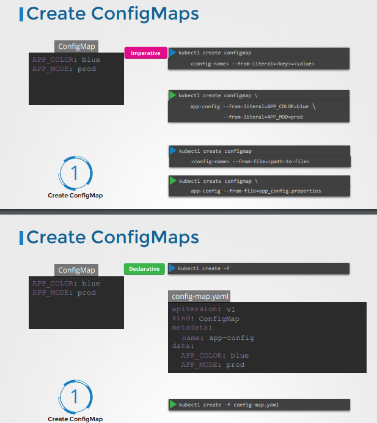

# APM

### Rolling Updates and Rollbacks

- When application is updated, a new rollout is deployed and a new
revision is created.

- kubectl roll status deployment/my-app/deployment

- Recreate deployment strategy: Destroy all applications then recreate all images at once
- Rolling update deployment strategy: Destroy and bring up a newer version one by one.(this is the default deployment strategy)


- kubectl apply -f deployment-definition.yml
   this is a declarative command to update the deployment

- kubectl set image deployment/myapp-deployment \ nginx=nginx:1.19
 this is a command to update the image in the deployment but it doesn't reflect on the yml file...

- Creates replicaset automatically, which creates automatically the number of pods.
- When upgrading , creates a new replicaset, adding pods to it, while simultaneously taking down the pods in the old replicaset 

- kubectl get ReplicaSets 


kubectl edit deployment frontend (edit/update and run deployment...)
or else vi <yaml file> if you have access to it...

Revise q11..
- start setting aliases??


### Application Commands (not in cert, but in important)

- docker run ubuntu, ran in bash , bash can't find terminal, it exits
[img.png](bash.png)- 
- docker ps // no processes appear
- docker ps -a // all the stopped and currently executing processes are ran. Ubuntu process appears
- containers not meant to host an operating system
- meant to host a database or do some computational analysis.

** dockerfiles**

FROM Ubuntu  //specifies the base image you are building from..
CMD sleep 5
- docker run ubuntu-sleeper sleep 10
- command at Startup: sleep 10

FROM Ubuntu
ENTRYPOINT["sleep"] //input one arg from command, it will be sleep
- docker run ubuntu-sleeper 10
-  command at startup: sleep 10


FROM Ubuntu
ENTRYPOINT["sleep"] //input one arg from command, it will be sleep
CMD["5"]
- docker run ubuntu-sleeper
- command at startup: sleep 5
- command line has precedence over base image file
so we can override it by doing
- docker run ubuntu-sleeper 10
- command at startup: sleep 10


### Commands and arguments


**Questions**
Question3: can do it as an array ....
command: ["sleep" ,"5000"]
command:
   - "sleep"
   - "5000" 


Question 5: got an error when i changed the containers sleep command from 1200 to 2000 and updated the
pod using the apply command in kubectl....solution: delete the pod then create it again...

A:If the pod is running, its state is different from what the yaml file state is..
theres more info on the pod now... thus you need to create and recreate the pod( depending on what needs to change)..
or use the approach in the vid..
kubectl edit pod
kubectl replace --force -f <file tmp name>..(kills existing pod, creats another one using the updating pod def yml)

iffy on Question 8.//command in yaml file overrides the entrypoint in dockerfile

Question 10.. error ... container must have a name...
have atleast - for the first one, to rep a list of key: values.


you can use kubectl <command...> --help , to get help outputted on the cli

## Configure env variables in Kubernetes
  - Use an env property..
  - Env is an array.. so we use "-"
  - Take env file outside of pod definition file, and manage it centrally, using config maps...




inorder to add a configmap to a pod definition yaml
you add 


```
- envFrom:
  - configMapRef
       name: app-config
```

### Kubernetes Secrets

- Secrets used to store secret information...
- secrets created imperatively or declaratively
- Using the cli or using a yaml file then doing create -f..
same goes with config files. 
Steps in 
- 1) create secret 2) inject it into pod


Access it in a pod through a single env variable..
with multiple env variables
or access it through the volume..
- there is a data section of the secret
- a person who is deploying applications in the same namespace have access to the sevrets so 
consider using AWS providers or applying least privilege.. RBAC.
- create a secret and implement it imperatively..(next line)>>
- kubectl create secret generic db-secret --from-literal=DB_Host=sql01 --from-literal=DB_User=root --from-literal=DB_Password=password123


we add the secrets to the containers since its where its needed..

### Encrypting Scripting Data at Rest
- Create a secret object in kubernetes cluster
- Output it in yaml, and you get the value encoding in base64. 
- To decode code it you need to do
- Echo "val" | base64 encode 


- Install apt-get etcd-client ( on windows use chocolately)
- etc ...
- ps aux | grep .... 
**Get back to this, just watch it for now(seems more complex then the other content, nice to know though)**

So rn its encoded not encrypted, thus
()
We create an encryption configuration(there is documentation for this) file..
specify what you want to encrypt( a secret,a configmap)
- kubectl get secrets --all-namespaces -o json | kubectl replace -f -


### MultiContainer Pods
- In Legacy we used monolith...
- Now we use Mircoservices , when you use mircoservices, it's easier to scale up and down.
- we have services that mesh together, we need a log agent for each webserver, but you want thekmk to be deployed seperate, thta
  can scale up and down together... share same network and have access to the same storage.
- 
- kubectl logs app -n elastic-stack

Q8: Edit the pod to add a sidecar container to send logs to Elastic Search. Mount the log volume to the sidecar container.
Q9.) 

- There are 3 common patterns, when it comes to designing multi-container PODs. The first and what we just saw with the logging service example is known as a side car pattern. The others are the adapter
- and the ambassador pattern.


### InitContianer

In a multi-container pod, each container is expected to run a process that stays alive as long as the POD's lifecycle. For example in the multi-container pod that we talked about earlier that has a web application and logging agent, both the containers are expected to stay alive at all times. The process running in the log agent container is expected to stay alive as long as the web application is running. If any of them fails, the POD restarts.
But at times you may want to run a process that runs to completion in a container. For example a process that pulls a code or binary from a repository that will be used by the main web application. That is a task that will be run only  one time when the pod is first created. Or a process that waits  for an external service or database to be up before the actual application starts. That's where initContainers comes in.
An initContainer is configured in a pod like all other containers, except that it is specified inside a initContainers section,  like this:

apiVersion: v1
kind: Pod
metadata:
  name: myapp-pod
  labels:
    app: myapp
spec:
  containers:
  - name: myapp-container
    image: busybox:1.28
    command: ['sh', '-c', 'echo The app is running! && sleep 3600']
  initContainers:
  - name: init-myservice
    image: busybox
    command: ['sh', '-c', 'git clone <some-repository-that-will-be-used-by-application> ; done;']


When a POD is first created the initContainer is run, and the process in the initContainer must run to a completion before the real container hosting the application starts. 

You can configure multiple such initContainers as well, like how we did for multi-pod containers. In that case each init container is run one at a time in sequential order.

If any of the initContainers fail to complete, Kubernetes restarts the Pod repeatedly until the Init Container succeeds.

apiVersion: v1
kind: Pod
metadata:
  name: myapp-pod
  labels:
    app: myapp
spec:
  containers:
  - name: myapp-container
    image: busybox:1.28
    command: ['sh', '-c', 'echo The app is running! && sleep 3600']
  initContainers:
  - name: init-myservice
    image: busybox:1.28
    command: ['sh', '-c', 'until nslookup myservice; do echo waiting for myservice; sleep 2; done;']
  - name: init-mydb
    image: busybox:1.28
    command: ['sh', '-c', 'until nslookup mydb; do echo waiting for mydb; sleep 2; done;']


Read more about initContainers here. And try out the upcoming practice test.
(study initcontainers more, then do the quiz....)

**Questions**
 1.) kubectl describe pod ( gets all pods description in the default namespace..)
 7.) Calculate the sleep times of the initContainers, and add them together..
10.) Status through kubectl get pods. get logs of pod, error initializing container.. 
log container, error found in commmand sleep.


