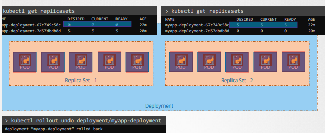
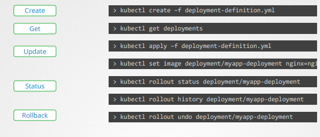
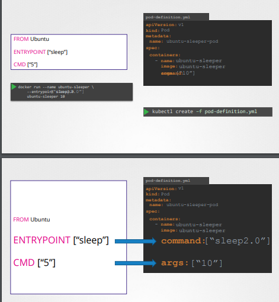

# APM

### Rolling Updates and Rollbacks

- When application is updated, a new rollout is deployed and a new
revision is created.

- kubectl roll status deployment/my-app/deployment

- Recreate deployment strategy: Destroy all applications then recreate all images at once
- Rolling update deployment strategy: Destroy and bring up a newer version one by one.(this is the default deployment strategy)

- kubectl apply -f deployment-definition.yml
   this is a declarative command to update the deployment

- kubectl set image deployment/myapp-deployment \ nginx=nginx:1.19
 this is a command to update the image in the deployment but it doesn't reflect on the yml file...

- Creates replicaset automatically, which creates automatically the number of pods.
- When upgrading , creates a new replicaset, adding pods to it, while simultaneously taking down the pods in the old replicaset 

- kubectl get ReplicaSets 

kubectl edit deployment frontend (edit/update and run deployment...)
or else vi <yaml file> if you have access to it...

Revise q11..
- start setting aliases??

### Application Commands (not in cert, but in important)

- docker run ubuntu, ran in bash , bash can't find terminal, it exits
[img.png](bash.png)- 
- docker ps // no processes appear
- docker ps -a // all the stopped and currently executing processes are ran. Ubuntu process appears
- containers not meant to host an operating system
- meant to host a database or do some computational analysis.

** dockerfiles**

FROM Ubuntu  //specifies the base image you are building from..
CMD sleep 5
- docker run ubuntu-sleeper sleep 10
- command at Startup: sleep 10

FROM Ubuntu
ENTRYPOINT["sleep"] //input one arg from command, it will be sleep
- docker run ubuntu-sleeper 10
-  command at startup: sleep 10

FROM Ubuntu
ENTRYPOINT["sleep"] //input one arg from command, it will be sleep
CMD["5"]
- docker run ubuntu-sleeper
- command at startup: sleep 5
- command line has precedence over base image file
so we can override it by doing
- docker run ubuntu-sleeper 10
- command at startup: sleep 10

### Commands and arguments

**Questions**
Question3: can do it as an array ....
command: ["sleep" ,"5000"]
command:
   - "sleep"
   - "5000" 

Question 5: got an error when i changed the containers sleep command from 1200 to 2000 and updated the
pod using the apply command in kubectl....solution: delete the pod then create it again...

A:If the pod is running, its state is different from what the yaml file state is..
theres more info on the pod now... thus you need to create and recreate the pod( depending on what needs to change)..
or use the approach in the vid..
kubectl edit pod
kubectl replace --force -f <file tmp name>..

iffy on Question 8.

Question 10.. error ... container must have a name...
have atleast - for the first one, to rep a list of key: values.