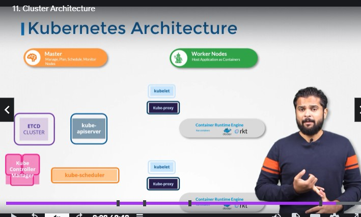

### Cluster Architecture

- The purpose of kubernetes is to host your applications in form of containers in an automated fashion
  to easily deploy instances of the application as requested, and easily communicate between services in your application.

**Boat analogy to describe different components of kubernetes**

- (ships) Worker nodes: nodes that host applications as containers..
- (control ship) master node: manage,plans,schedule,monitor worker nodes

- ETCD cluster: database that stores data(maintain info on the nodes) in a "key:value" format..
- Kube-scheduler(crane): if pods are destroyed it schedules the right pod to put a node on depending on size/capacity/num of containers already in node and E.T.C...

Controller-manager:
- Node-controller: Takes care of nodes, Onboarding nodes if nodes are running... 
- Replication controller: makes sure Desired number of containers are running at the same time 

- Kube-apiServer:
  Used by External Viewers, orchestrates all operations in the cluster...
  (captain of ship) kubelet is an agent that runs on each cluster.... fetches status of nodes and containers in them. Destroys nodes.

- Kube-proxy: Allows containers to reach each other. Enables communication between services

- Runtime of containers in node can be docker

**review stopped here**

  

- Kubectl get pods kubesystems
- Get all pods n the kubesystem namespace
- ps -aux | grep kube-scheduler

## ETCD

Run ETCD Service
./etcd

./etcdctl set key1 value1

./etcdctl get key1
value1

./etcdctl

Api versions changed from v2 to v3

./etcdctl --version
API version: 2

inorder to use the second version of etcdctl_API we need to ....
ETCDCTL_API=3 ./etcdctl version

export ETCDCTL_API=3 ./etcdctl version

### ETCD in Kubernetes

- ETCD stores nodes,PODSmconfigs,secrets,accounts,roles,binding,others

- Advertise-client-urls --> Address on which etcd listens..

- initial-cluster-controller , where diff etcd instances are located.

### Kube-Scheduler

- Filter nodes rank nodes..

- Calculate number of resources in nodes free.. Gets a better rank..

### Controller in Kubernetes

- Watch status(continually monitor the health of the nodes) remediate situation

- Node monitor period = 5s node monitor grace periodnode monitor grace period

- POD Eviction Timeout = 5m kube-controller-manager contains all these options.

### Kubelet

- Sole point of contact from the master ship(master node)

- Kubelet register node with kubernetes cluster, requests runtime container to pull required image and run the instance.

- kubelet monitors the node and pods and keeps the kubeapi-server up-to date on that..

- ps -aux | grep kubelet

### Kube proxy

- Pod Network

- Look for new services, creates appriopriate rules on each node
  aptablerules on each node in the cluster...to the actual IP in the POD.

### A Pod

- Encapuslate a container in a pod
- Deploy new pods

- Without kubernetes , We need to create a container, create a helper that would link to the container
- node to inform the original continer abiout architectural changes, so you get a helper container that maintains a one-to-one relationship with the container

kubectl run nginx --image nginx ==> pull the nginx image from dockerhub and run it in a pod
kubectl get pods ===> gets all pods in cluster

**Pods in Yaml**
apiVersion: v1 --> String
kind:pod //type of resource were creating --> String
metadata: --> Dictionary
name: myapp-pod //pod with name myapp-pod
labels:
app: myapp
type: front-end
spec:
containers //pod can have more then one pod - name: nginx-container
image:nginx
