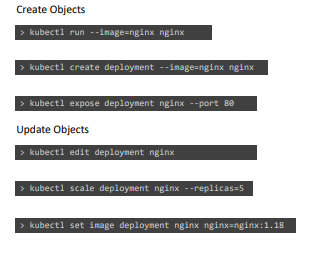
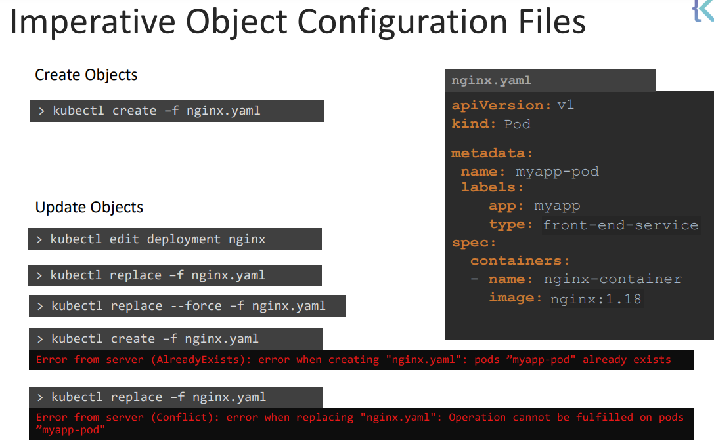
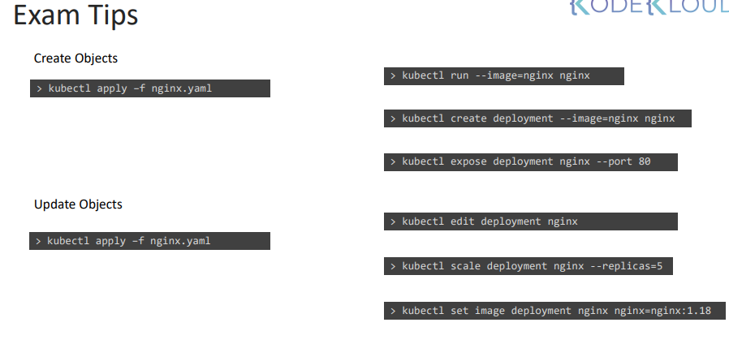

# Create and Config Pods

## Replicas (replicaset and replicacontroller(legacy))

### ReplicaController

### Create and Config Pods

### ReplicaControllers(legacy)

- Have a single pod running in a node, if the pod crashes, we lose the containers in the pod.

- ReplicationController controls the amount of pods running at the same time in the node..

- To load balance and scale we use additional nodes as well, expanding our replication controller access..
  

- Replication controller is legacy, we use replica set now...
- Now we use replicaSet

- In replica sets we require selectors.
- Selectors use labels so we know namespace to replicate the pods..
- To scale for more replicas of a pod we can update the yaml file
- Labels are properties that we can attach to each item for example for their type, kind, and so on. Selectors help us in finding these items. You can think of a selector as a filter. We could label pods based on some attributes i.e. app name, front-end, back-end.(copied)
  **Ways to Scale..**
- kubectl edit to edit the existing running replicaset.
- kubectl replace -f <enter yaml file>
- kubectl scale --replicas=6 -f replicaset-definition.yml // can do it from the command line, if replicaset hasnt been created yyet.
- kubectl scale --replicas=6 replicaset myapp-replicaset
  **Other commands in kubectl**
- kubectl get replicaset-- get all ReplicaSets in the default namespace.
- kubectl explain replicaset | grep VERSION ===> gives you the version of replicaset
- kubectl create -f <yaml file> to create any kubernetes resource...
- kubectl delete <resource> <resource name>
- kubectl edit replicaset <replicaset> then do ...

- Replicaset makess sure that theres always the specified num of pods are running, that were identified in the yaml file.

- Have a single pod running in a node, if the pod crashes, we lose the containers in the pod.

- ReplicationController controls the amount of pods running at the same time in the node..

- To load balance and scale we use additional nodes as well, expanding our replication controller access..
  

- Replication controller is legacy, we use replica set now...
- Now we use replicaSet

### ReplicaSet:

- In replica sets we require selectors.
- Selectors use labels so we know namespace to replicate the pods..
- To scale for more replicas of a pod we can update the yaml file
- Labels are properties that we can attach to each item for example for their type, kind, and so on. Selectors help us in finding these items. You can think of a selector as a filter. We could label pods based on some attributes i.e. app name, front-end, back-end.(copied)
  **Ways to Scale..**
- kubectl edit to edit the existing running replicaset.
- kubectl replace -f <enter yaml file>
- kubectl scale --replicas=6 -f replicaset-definition.yml // can do it from the command line, if replicaset hasnt been created yyet.
- kubectl scale --replicas=6 replicaset myapp-replicaset
  **Other commands in kubectl**
- kubectl get replicaset-- get all ReplicaSets in the default namespace.
- kubectl explain replicaset | grep VERSION ===> gives you the version of replicaset
- kubectl create -f <yaml file> to create any kubernetes resource...
- kubectl delete <resource> <resource name>
- kubectl edit replicaset <replicaset> then do ...
- Kubectl get pod -o wide <IP- ip of Pod>
- Replicaset makes sure that there's always the specified num of pods are running, that were identified in the yaml file.

## Deployment:

- deployment is another lvl of abstraction in kubernetes..
- deployment automatically creates a replicaset and pods
- deployment is the same but it creates a new kubernetes object(deployment)
  which you can get , doing kubectl get deployments
  

- To see all objects created, do kubectl get all

## Services

- service directs traffic to pods through selectors..
  these 3 pods have app:sddfs so those pods is where im going to direct traffic to bc my selector is that.
- what is a service and when we need it

- each pod has its own IP address
  pods are ephermeral- are destroyed frequently, a new pod with a new pod takes it's place.
  Thus it would be ideal to have a stable IP address.
  That's were services comes in handy.

Services:

- Stable IP Address
- Load balancing
- Loose coupling

- Services of three types ClusterIP,NodePort and LoadBalancer

### ClusterIP Services

- Request goes from ingress to service
- Request gets handed over to the Service
- Service forwards request over to one of the pods that have that service endpoint.
- Pods are identified using selectors.

### NodePort Services

- Nodeport service, service listens to requests on the node.
  Ports in a service nodeport
- 1: Targetport Port of the targeted pod(80)
- 2: Service port: Port of the service object(80)
- 3: Nodeport: Port of the node (by default 30008-32000)
- Port is the only one thats required...
- Nodeport defaults to a value and targetport defaults to the port number

If pods are in diff nodes, services extends across all of the nodes..

### Load Balancer

[img_3.png](img_3.png)

- LoadBalancer Service is an extension of NodePort Service
- NodePort Service is an extension of ClusterIP Service.

- Need a single url to access the application
- Create a new vm, and install an config an appriprote load balancer in it

### Namespaces

- kube-system and kube-public are created to deal with things in the background (DNS services and what not)
- namespaces are usually used for enterprise purposes, right now its not really needed
- can have its own set of policies
- namespaces can be used to allocate resources fairly

- Default domain

- 

- 

- Identify current context then.

### Declarative vs Imperative in Kubernetes

- (From google) imperative code focuses on writing an explicit sequence of commands to describe how you want the computer to do things, 
 
- And declarative code focuses on specifying the result of what you want.

- How to bring infrastructure to your needs.

- Create a set of files.

- imperative commands 

- run once and forgotten.
- not good for complex environments
- That's were creating obj def files help out

### Declarative
- kubectl apply -f nginx.yaml
- kubectl apply -f /path/to/config-files

If I use it again...
- kubectl apply -f nginx.yaml
- Knows object's exist's and updates it
but kubectl create knows object exists so it doesn't create it.

--dry-run=client will tell you if you can run the command and create the resource.
- o yaml: This will output the resource definition in YAML format on screen.

- "kubectl create pod  httpd --image=httpd:alpine- "
- **Why doesn't this above command work?? 

- kubectl run httpd --image=httpd:alpine --port=80 --expose
This creates and runs a pod with image httpd:alpine, also created a service of type ClusterIP by the same name (httpd). The target port for the service is 80.

### Apply
- Don't mix the imperative and declarative commands..
declarative command apply stores the last applied configuration in json format in the yaml file
while the imperative command does not.. 

