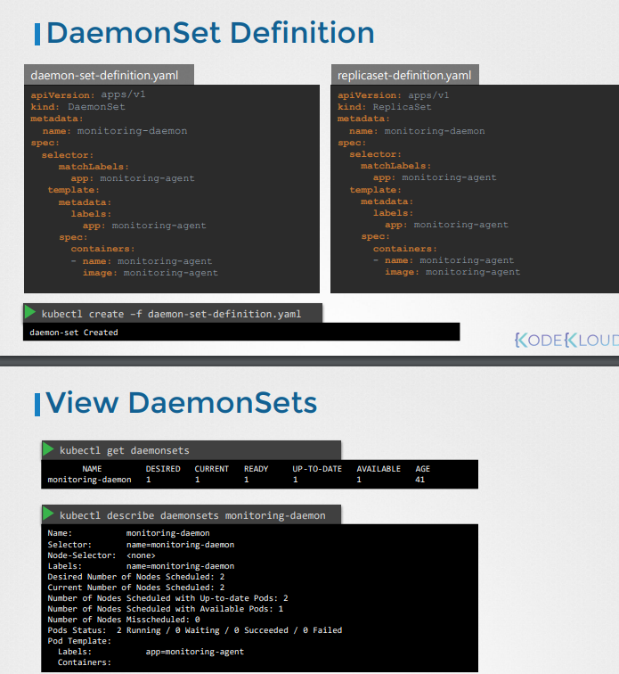

~~# Scheduling

### assigning pods to nodes without scheduling

- Pods have a pending status until they get assigned
  to a node...
- Nodes can be assigned through the keyword "nodeName:<enter node>"
- You can assign a pod to a node by creating a binding obj, specify the target ...

- 

Q4) kubectl replace --force -f nginx.yaml

- forces the file to delete resources then create it again


### Labels and Selectors

- Labels and selectors are a standard group to filter
- Labels are items, we attach properties to each item to make it easier to find
  the right item.
- we put labels on apps, then use selectors to find those apps

**Quiz Questions**

1.) We have deployed a number of PODs. They are labelled with tier, env and bu. How many PODs exist in the dev environment (env)?

- we do kubectl get pods --selector env=dev to filter and get the pods in the dev environment...

- kubectl get all --selector env=prod
- get all objects in the default kubernetes

## Taints and Tolerations

- Some bugs are tolerant to the smell some are not tolerant to the smell.

- When pods created, the pods are scheduled to nodes in a reasonably fashion

- But when we taint a node, none of the pods can go in it unless they tolerate the tainted node...
- Taints defined on nodes , tolerants defined on pods..

- kubectl taint nodes node=name key=value:taint-effect

**Quiz Question**

- Create a taint on node01 with key of spray, value of mortein and effect of NoSchedule

Ans: kubectl taint nodes node01 spray=mortein:NoSchedule

- Create another pod named bee with the nginx image, which has a toleration set to the taint mortein.

  Ans: ```
   apiVersion: v1
   kind: Pod
   metadata:
     name: bee
   spec:
     containers:
     - image: nginx
       name: bee
     tolerations:
     - key: spray
       value: mortein
       effect: NoSchedule
       operator: Equal
    ```
 - Create this pod definition file. then run it..

 - Remove the taint on controlplane, which currently has the taint effect of NoSchedule.
 Ans: kubectl taint nodes controlplane node-role.kubernetes.io/control-plane:NoSchedule-
Place extra emphasis on the "-" sign at the end, that's what untaints it.


### Node Selectors

- You have 3 nodes in your current setup, pods can go to any Node even though some of the nodes with lower hardware resources, diff workloads in your cluster, high horsepower to the larger node..
you can use node selectors to deal with this issue


- kubectl label nodes <node-name> <label-key>=<label-value>
- kubectl label nodes node-1 size=large

```
- nodeSelector:
    size: Large
```

### Node Affinity
- Ensure that pods are hosted on particular nodes..

- If label large is removed from the node, the pod is removed from the node.

**Node Affinity:Questions**

- Label node1 to blue
  Ans: kubectl label node node01 color=blue
- Create a new deployment named blue with the nginx image and 3 replicas
  Ans: kubectl create deployment blue --image=nginx --replicas=3

- Check if controlplane and node01 have any taints on them that will prevent the pods to be scheduled on them. If there are no taints, the pods can be scheduled on either node.
So run the following command to check the taints on both nodes.

- Ans: So we check if theres any taint on the node...
  kubectl describe node controlplane | grep -i taints
  kubectl describe node node01 | grep -i taints
  if there is, a pod cant enter it and vice versa
- Set Node Affinity to the deployment to place the pods on node01 only.
Ans:
```
apiVersion: apps/v1
kind: Deployment
metadata:
  name: blue
spec:
  replicas: 3
  selector:
    matchLabels:
      run: nginx
  template:
    metadata:
      labels:
        run: nginx
    spec:
      containers:
      - image: nginx
        imagePullPolicy: Always
        name: nginx
      affinity:
        nodeAffinity:
          requiredDuringSchedulingIgnoredDuringExecution:
            nodeSelectorTerms:
            - matchExpressions:
              - key: color
                operator: In
                values:
                - blue
```
- operator: in/not in/exists
  values:
- Small
- Medium

- What if no node is found...
  this is what node affinity types are for
  requiredDuringSchedulingIgnoredDuringExecution:~~
  preferredDuringSchedulingIgnoredDuringExecution:


- Create a new deployment named red with the nginx image and 2 replicas, and ensure it gets placed on the controlplane node only.
Use the label key - node-role.kubernetes.io/control-plane - which is already set on the controlplane nod


### Taints and Tolerations vs Node Affinity
 
- We taint the nodes, we tolerate some pods for the nodes..
- We taint the nodes, we use node affinity for some pods 


### Resource Requirements and Limits

- Cpu memory and disk resources in a node
- Once you put a pod in a node,some of those resources get taken up.
- if no space for pod to go, pod will be in a pending state.
- Container limited to 1vcpu, 512Mi memory
- If you go beyond the cpu limit, kubernetes throttles the CPU..

### Daemon Sets
- A DaemonSet ensures that all (or some) Nodes run a copy of a Pod.
- runs one copy of your pod in all nodes.
- if the pods die the node dies
- kubeproxy deployed in all nodes.. we can use a daemonset for that 
- purpose: log viewer, monitioring solutions.. 
- daemonSets are the same as replicasets in terms of when doing yaml definition.

- you can put nodeName on the poddefnition to assign it to a certain node
- but that is legacy
- now we uses nodeAffinity and default scheduler to schedule pods

**Questions**
- Namespaces are a way to organize clusters into virtual sub-clusters
Q: Which namespace are the DaemonSets created in?
A: kubectl get daemonsets --all-namespaces(or -A)
-n for namespace

Q: Deploy a DaemonSet for FluentD Logging.
A: Dry run to create a deployment file(since daemonset and deployment definitions are similar... then edit it..
- kubectl create deployment elasticsearch -n kube-system --image=<insert>  --dry-run=client -o yaml > fluentd.yaml
- vi fluentd.yaml
- change kind to daemonSet and remove replicas..
- kubectl create -f fluentd.yaml


### Static Pods

- If there were no master node no apiserver
- we can still run pods and operate as an independent worker node..
- we can config kubelet to read pod in a directory.. 
- kubelet recreates pod for the pod definition changes in the directory..
- kubelet only works on a pod lvl

- to config this in kubernetes you can do it in two ways


- kubectl creates pods through http endpoint (kubeApiserver) or yaml definition files..
- If you were to use the kubernetes cluster .. these static pods will appear as read only pods..

### Static Pods vs DaemonSet
- Static pods are created by the kubelet, Its control plane components are created through the pods
 and all its pod are ran in a directory. It also doesn't use the kube-scheduler
- DaemonSets are created in every node. Meant for monitoring the pods of the node.
- it uses the kubernetes cluster.It also doesn't use the kube-scheduler.

**Questions**
Q: How many pod definition files are present in the manifests folder?
A: 4

Q: Create a static pod called static-busybox with the image busybox, sleep 1000 and put it in the node staticpod directory..
A: kubectl run --restart=Never --image=busybox static-busybox --dry-run=client -o yaml --command --sleep 1000 > /etc/kubernetes/manifests/static-busybox.yaml

Q10)
A: static pods are recreated using there pod definition yaml when deleted so you need to ssh into the node to delete the yaml file
that keeps being created. 

### Additional Scheduler


- We can create additional schedulers using pods
- We run a command on a kube-schedule image so that it has the appropriate configurations we want,
We use the key value scheduler:<enter pod scheduler> to assign the additional scheduler to
a pod. 


- Deploy Additional Scheduler


**Questions**

Q: Create a configmap that the new scheduler will employ 
using the concept of Configmap as a volume. Create a configmap with name my-scheduler-confug using the content of file
/root/my-scheduler-config.yaml...
A: kubectl create configmap my-scheduler-config
--from-file=/root/my-scheduler-config.yaml -n kubesystem..
- I don't understand --from-file keyword
- kube-system is the namespace for objects created by the Kubernetes system. Typically, this would contain pods like kube-dns , kube-proxy , kubernetes-dashboard and stuff like fluentd, heapster, ingresses and so on (copied online)


### Scheduler Profiles  *
**comeback to make notes on this**
There are 4 phases in a scheduler:
scheduling queue,filtering,scoring,binding
- pod on scheduling queue
- filter out based on lack of resources
- score based on free space...
- pod finally gets binded with the node


if we have different schedulers, they run as diff rp


