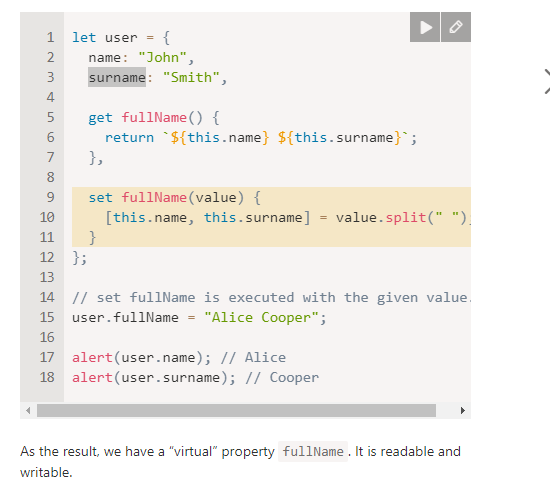
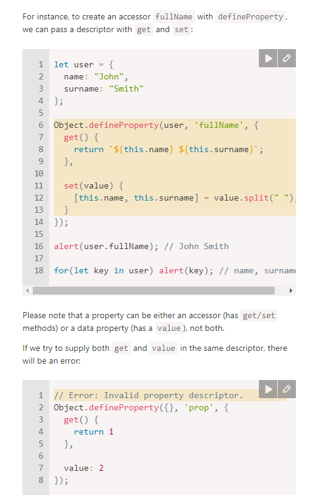
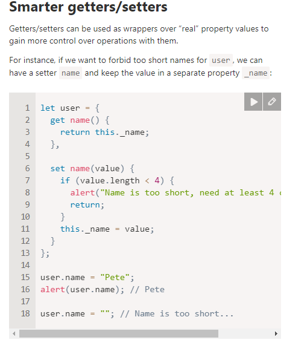
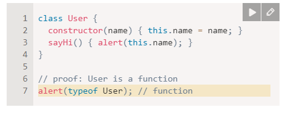
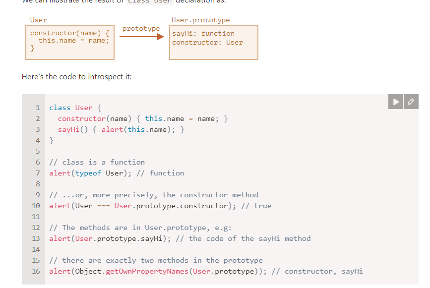
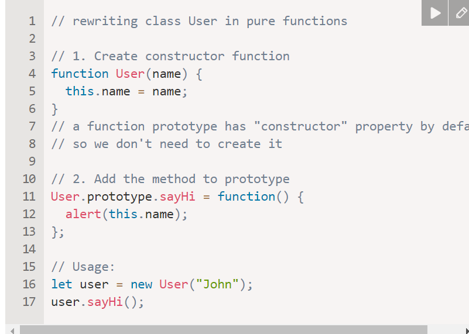
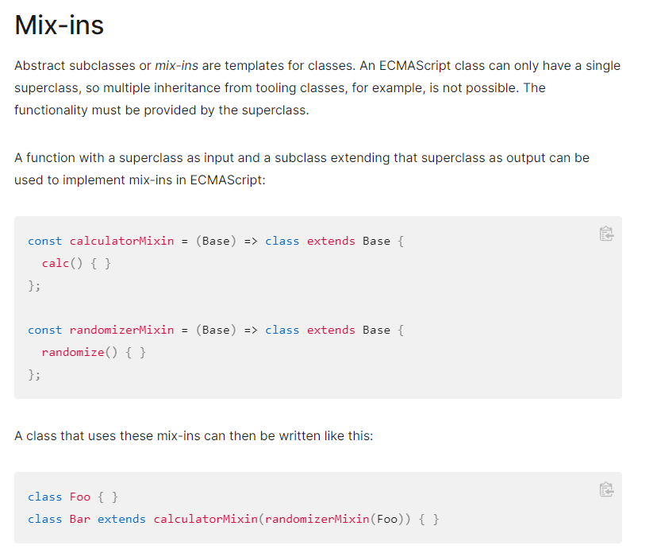
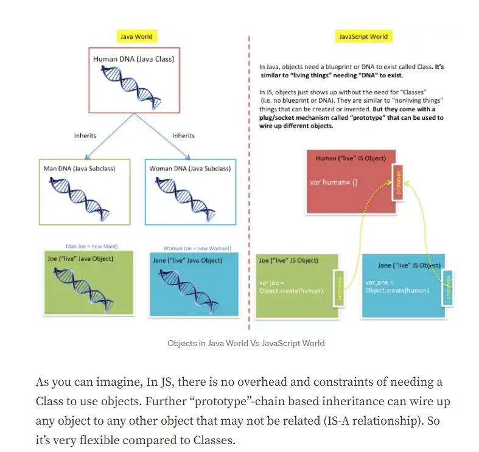
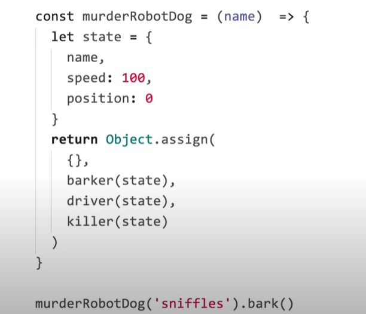

# Classes:


### Intro to Classes
- ES6 introduced a syntax for object creation that uses the class keyword.
Classes are a new syntax that do the same thing as object constructors and prototypes.
You can use classes the same way you do with object constructors

- Those who oppose classes see it as syntactic sugar over existing prototype-based constructors and that its dangerous or misleading to obscure what's going on.
- If you choose to use classes in your code (that’s fine!) you can use them much the same way as object constructors.

### Setters and Getters



- We can change the value of the object outside the object through of use setters and getters.
- Without a setter we can change it and without a getter we can get it from the user object.


Accessor descriptors:

- Accessor descriptors use setter and getter functions instead of data properties.




- Can use setters and getters to be wrappers over values, make sure the data is valid



### Class basic syntax

- The original class structure below
```
class MyClass {
  // class methods
  constructor() { ... }
  method1() { ... }
  method2() { ... }
  method3() { ... }
  ...
}

```

- Q: What is a class?
- A: Class is a type of function



- Q: How do classes function?
- A: Create a function named User, result of class declaration.
- Store all of its methods into the User.prototype.
- The function code is taken from the constructor method.



- The important difference of class fields is that they are set on individual objects, not User.prototype:
- Classes are the equivalent to an object constructor and prototype representing methods in the class.



- class User {
  name = "John";
  }

let user = new User();
alert(user.name); // John
alert(User.prototype.name); // undefined


- class has a basic syntax..
```
class MyClass {
  prop = value; // property

  constructor(...) { // constructor
    // ...
  }

  method(...) {} // method

  get something(...) {} // getter method
  set something(...) {} // setter method

  [Symbol.iterator]() {} // method with computed name (symbol here)
  // ...
  
  
  
  
  
  
  
}
```


```
Binding this with prototype and static methods
When a static or prototype method is called without a value for this, such as by assigning the method to a variable and then calling it, the this value will be undefined inside the method. This behavior will be the same even if the "use strict" directive isn't present, because code within the class body's syntactic boundary is always executed in strict mode.

class Animal {
  speak() {
    return this;
  }
  static eat() {
    return this;
  }
}

const obj = new Animal();
obj.speak(); // the Animal object
const speak = obj.speak;
speak(); // undefined

Animal.eat() // class Animal
const eat = Animal.eat;
eat(); // undefined
```




resources for classes:

https://developer.mozilla.org/en-US/docs/Web/JavaScript/Reference/Classes
...

Java object vs a javaScript object






### Knowledge Check:

Describe the pros and cons of using classes in JavaScript.
Pros: 
- Gives us another way to create objects
- Class is something everyone learns from other language, thus incorporating it in javascript helps
Cons:
- Prototypes are more flexible(prototype is all the inherited methods an object has..)
- classes make things brittle


How does JavaScript’s object creation differ from a language like Java or Ruby?
In java, objects are created through using a new keyword, creating an instance of a class
In javascript objects dont need a class to create an object. infact, classes are just syntactic sugar.


Explain the differences between object constructors and classes.

1) First, a function created by class is labelled by a special internal property [[IsClassConstructor]]: true. So it’s not entirely the same as creating it manually.

2) The language checks for that property in a variety of places. For example, unlike a regular function, it must be called with new:
Class methods are non-enumerable. A class definition sets enumerable flag to false for all methods in the "prototype".

3) That’s good, because if we for.. in over an object, we usually don’t want its class methods.
Classes always use strict. All code inside the class construct is automatically in strict mo


// get back to this..
What are “getters” & “setters”?
  Setters and getters are methods in a class that get the value of the classes fields or modifies the classes fields, outside of the class.
  scope.
Describe computed names and class fields.
class fields in a class
Describe function binding.
binding a function so that
Describe static properties.
How is inheritance used with classes?
Why is favoring Composition over Inheritance suggested?


